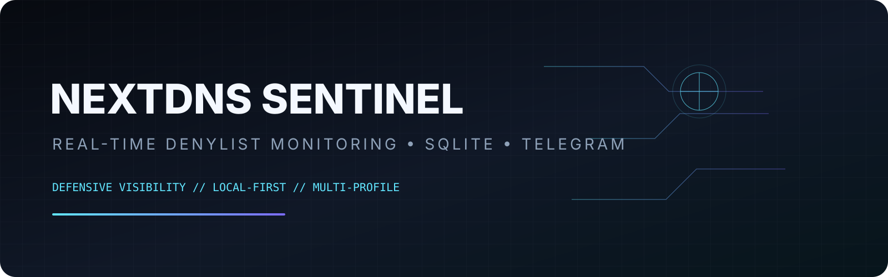

# 🛡️ NextDNS Sentinel



> Real-time monitoring for **NextDNS custom denylist matches**, built for defensive visibility across the profiles you own or administer.

[](https://www.python.org/)
[](https://www.sqlite.org/)
[](https://nextdns.io/)
[](LICENSE)

## ✨ Overview

**NextDNS Sentinel** watches NextDNS logs, compares observed domains against each profile's custom denylist, persists monitoring data in a local SQLite database, and can send real-time Telegram alerts.

The project is intentionally local-first: your API keys and Telegram credentials are supplied through environment variables rather than committed to the repository.

## 🚀 Features

- 🔍 Continuous NextDNS log monitoring
- 🛡️ Custom denylist matching, including subdomains and wildcard-style entries
- 👥 Multiple NextDNS profiles
- 💾 SQLite persistence for accounts, denylist snapshots, and alert history
- 🚨 Telegram notifications for new matches
- 🌐 Optional local web dashboard
- 🧠 Duplicate-event protection using deterministic event fingerprints
- 📊 Recent alert and monitoring statistics
- ⚙️ Environment-based secrets configuration
- 🧵 Independent monitoring threads for active profiles
- 📝 Structured application logging

## 🏗️ Architecture

```text
NextDNS API
    │
    ├── Profiles
    ├── Custom Denylist
    └── Logs
         │
         ▼
┌──────────────────────┐
│   NextDNS Sentinel   │
│  Monitor + Matcher   │
└──────────┬───────────┘
           │
     ┌─────┴─────┐
     ▼           ▼
 SQLite DB    Telegram
     │         Alerts
     ▼
 Local Dashboard
```

## 📦 Installation

```bash
git clone https://github.com/eldqyqy2007/nextdns-sentinel.git
cd nextdns-sentinel

python -m venv .venv
# Linux/macOS
source .venv/bin/activate
# Windows
# .venv\\Scripts\\activate

pip install -r requirements.txt
```

## ⚙️ Configuration

Copy the example configuration:

```bash
cp config.example.json config.json
```

Set each account's API-key environment variable:

```bash
export NEXTDNS_PROFILE_1_API_KEY="your-nextdns-api-key"
export TELEGRAM_BOT_TOKEN="your-bot-token"
export TELEGRAM_CHAT_ID="your-chat-id"
```

Then update `config.json` with your profile ID and the corresponding environment-variable name.

**Never commit API keys, bot tokens, `data/sentinel.db`, or local configuration containing secrets.**

## ▶️ Usage

Start monitoring:

```bash
python nextdns_sentinel.py --monitor
```

Start the local dashboard:

```bash
python nextdns_sentinel.py --dashboard
```

By default the dashboard binds to `127.0.0.1:5000`. You can change it with `--host` and `--port`.

## 🗄️ Data

The application creates:

- `data/sentinel.db` — SQLite database
- `config.json` — local configuration
- application logs through Python logging

The database is created automatically on first run.

## 🔐 Security Notes

- Use API keys only for NextDNS profiles you are authorized to administer.
- Keep credentials outside Git whenever possible.
- The dashboard is local-only by default.
- If you expose the dashboard beyond localhost, place it behind appropriate authentication and network controls.
- SQLite is persistence, not encryption. Protect the database file with normal filesystem permissions and backups.

## 🧪 Project Status

This repository is intended as a practical defensive monitoring utility. NextDNS API behavior can change, so API responses should be validated against the current NextDNS API documentation when upgrading the project.

## 🤝 Contributing

Issues and pull requests are welcome. Please avoid including real API keys, Telegram tokens, IP addresses, or private logs in issues and commits.

## 📄 License

MIT License. See [LICENSE](LICENSE).
