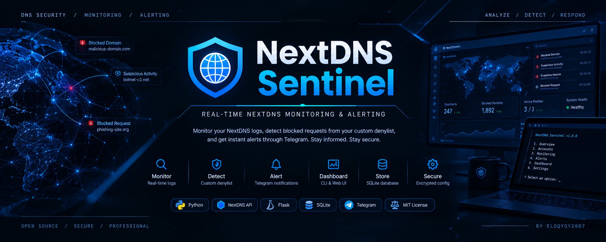

<p align="center">
  
</p>

<p align="center">
  <a href="LICENSE"></a>
  
  
  
  
</p>

# NextDNS Sentinel

A local-first monitoring utility for **NextDNS profiles you own or administer**. It continuously reads NextDNS logs, checks observed domains against each profile's custom denylist, stores monitoring data in a local SQLite database, and sends optional Telegram alerts when a new match is detected.

The project is designed around a simple principle: **keep operational data local, keep secrets outside the repository, and provide a clear view of what the monitor is detecting.**

---

##  Table of contents

- [Overview](#overview)
- [Features](#features)
- [Architecture](#architecture)
- [Requirements](#requirements)
- [Installation](#installation)
- [Configuration](#configuration)
- [Usage](#usage)
- [Web dashboard](#web-dashboard)
- [Data and storage](#data-and-storage)
- [Security](#security)
- [Project structure](#project-structure)
- [Limitations](#limitations)
- [Contributing](#contributing)
- [License](#license)

---

##  Overview

NextDNS Sentinel is intended for defensive visibility over NextDNS configurations that you are authorized to manage.

The monitor:

1. Loads one or more configured NextDNS profiles.
2. Retrieves the current custom denylist for each active profile.
3. Polls recent DNS logs on a configurable interval.
4. Matches observed domains against the denylist, including parent-domain and wildcard-style matching.
5. Stores matched events and denylist snapshots in local SQLite.
6. Sends a Telegram notification for newly detected matches.
7. Exposes an optional local dashboard for recent statistics and alerts.

No hosted database or project-owned backend is required.

---

##  Features

- **Real-time monitoring** of recent NextDNS DNS logs.
- **Custom denylist detection** with exact, parent-domain, and wildcard-style matching.
- **Multi-profile support** for multiple NextDNS configurations.
- **Local SQLite persistence** with no external database service.
- **Encrypted API-key storage** inside the local SQLite database using Fernet encryption.
- **Environment-based secrets** so API keys and Telegram credentials are not placed in Git.
- **Telegram alerting** for newly detected denylist matches.
- **Duplicate-event protection** using deterministic event fingerprints.
- **Local web dashboard** with account, denylist, and alert statistics.
- **Independent monitoring threads** for active profiles.
- **Structured logging** for monitoring and API failures.
- **Configurable polling, HTTP timeout, database path, host, port, and log level** through environment variables.

---

##  Architecture

```text
                         NextDNS API
                             |
              +--------------+--------------+
              |              |              |
           Profiles       Denylist         Logs
              |              |              |
              +--------------+--------------+
                             |
                             v
                  +----------------------+
                  |   NextDNS Sentinel   |
                  |  Monitor + Matcher   |
                  +----------+-----------+
                             |
              +--------------+--------------+
              |                             |
              v                             v
       Local SQLite DB                 Telegram API
              |                             |
              v                             v
       Local Web Dashboard             Alerts
```

The application remains local-first: NextDNS is the monitored data source, SQLite is the local persistence layer, and the optional dashboard binds to localhost by default.

---

##  Requirements

| Requirement | Purpose |
|---|---|
| Python 3.10+ | Runtime |
| NextDNS API access | Profile, denylist, and log monitoring |
| Telegram bot and chat ID | Optional alert delivery |
| `cryptography` | Encrypting API keys at rest |
| SQLite | Built into Python; used for local persistence |

---

##  Installation

Clone the repository and create an isolated Python environment:

```bash
git clone https://github.com/eldqyqy2007/nextdns-sentinel.git
cd nextdns-sentinel
python -m venv .venv
```

**Linux / macOS**
```bash
source .venv/bin/activate
```

**Windows**
```powershell
.venv\Scripts\Activate.ps1
```

Install dependencies:

```bash
pip install -r requirements.txt
```

---

##  Configuration

Copy the example configuration:

```bash
cp config.example.json config.json
```

Generate a Fernet key:

```bash
python -c "from cryptography.fernet import Fernet; print(Fernet.generate_key().decode())"
```

Set it as `NEXTDNS_SENTINEL_SECRET_KEY`, then configure the environment variables referenced by `config.json`.

```bash
export NEXTDNS_SENTINEL_SECRET_KEY="your-fernet-key"
export NEXTDNS_PROFILE_1_API_KEY="your-nextdns-api-key"
export TELEGRAM_BOT_TOKEN="your-telegram-bot-token"
export TELEGRAM_CHAT_ID="your-telegram-chat-id"
```

The Fernet key is required to decrypt API keys already stored in SQLite. Keep it outside Git and back it up securely.

---

##  Usage

Start live monitoring:

```bash
python nextdns_sentinel.py --monitor
```

Start the local dashboard:

```bash
python nextdns_sentinel.py --dashboard
```

The dashboard listens on `127.0.0.1:5000` by default.

---

##  Web dashboard

The dashboard provides:

- Configured and active profile counts.
- Total detected alerts.
- Current denylist-entry count.
- Recent matched domains.
- Detection reason and event time.
- Client IP when present in the NextDNS log response.

It requires no separate frontend build system or external database. Keep it bound to `127.0.0.1` unless you intentionally add authentication and network controls.

---

##  Data and storage

All persistence is local:

```text
data/
└── sentinel.db
```

SQLite stores profile metadata, encrypted API keys, denylist snapshots, alert history, and event fingerprints.

No external database server or project-owned backend is required.

---

##  Security

- Monitor only profiles you own or are authorized to administer.
- API keys are supplied through environment variables and encrypted before SQLite storage.
- Telegram credentials remain environment-based.
- Do not commit `config.json`, database files, generated secrets, or private logs.
- Protect `NEXTDNS_SENTINEL_SECRET_KEY`.
- The local dashboard is not an authentication system.
- SQLite encryption here protects the API-key field at the application layer; it does not encrypt the entire database file.

---

##  Project structure

```text
nextdns-sentinel/
├── assets/
│   ├── a_wide_cinematic_cyber_tech_themed_banner_hero_i.png
│   └── icons/
├── config.example.json
├── nextdns_sentinel.py
├── requirements.txt
├── .gitignore
├── LICENSE
└── README.md
```

---

##  Limitations

- Monitoring depends on NextDNS API availability and response format.
- Polling is not a provider-side streaming connection.
- The dashboard is intentionally local and lightweight.
- SQLite is for local persistence, not distributed operation.
- Losing the Fernet key makes previously encrypted API keys unrecoverable.
- Validate API behavior against current NextDNS documentation when upgrading.

---

##  Contributing

Issues and pull requests are welcome. Never include API keys, Telegram bot tokens, private chat IDs, private DNS logs, or sensitive profile information in issues or commits.

##  License

This project is licensed under the [MIT License](LICENSE).
